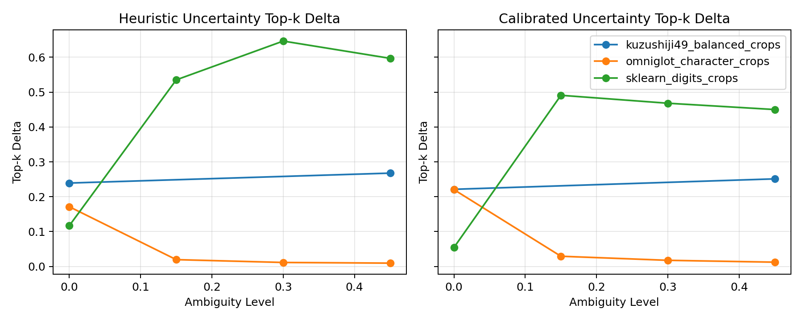
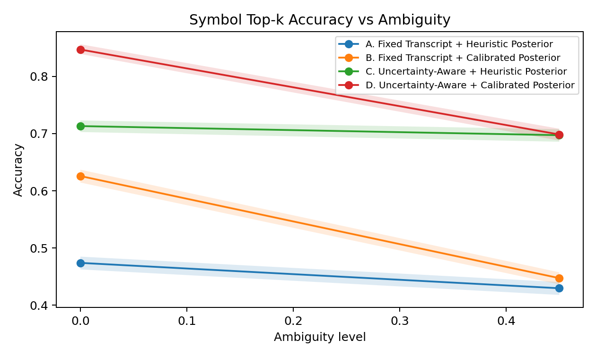

# Preserving Transcription Uncertainty Improves Symbol-Level Glyph Reasoning Under Ambiguity: Evidence from Three Real Datasets

*A cross-dataset study of uncertainty-aware inference for ambiguous handwritten-symbol recognition, framed as a symbol-level robustness problem rather than a semantic decipherment claim.*

## Abstract

Decipherment pipelines for rare scripts, cipher alphabets, and damaged artifacts often collapse uncertain visual evidence into a single transcript too early. This can discard correct alternatives before structural diagnostics or downstream reasoning have a chance to use them. We present DecipherLab, a research-grade framework for uncertainty-aware decipherment experiments that preserves top-k transcription posteriors, compares fixed versus uncertainty-aware inference, and reports explicit failure cases rather than only positive averages. The implemented evaluation protocol crosses fixed versus uncertainty-aware inference with heuristic versus calibrated posterior generation, and pairs this four-condition comparison with bootstrap confidence intervals, multi-seed summaries, and manifest-backed real glyph-crop datasets.

The current external evidence pack covers three real handwritten-symbol corpora with different visual statistics: Omniglot, scikit-learn digits, and Kuzushiji-49. Across all three datasets, preserving uncertainty improves symbol top-k retention relative to hard transcript collapse under matched posterior families. The effect size is dataset-dependent: it is smallest on Omniglot, largest on scikit-learn digits, and intermediate on the historically grounded Kuzushiji-49 corpus. Calibration remains inconsistent across datasets: it helps on Omniglot and Kuzushiji-49, but hurts on scikit-learn digits. We therefore support a narrow claim only: preserving transcription uncertainty improves symbol-level retention of correct alternatives under ambiguous observations relative to hard transcript collapse, and this effect replicates across three real handwritten-symbol datasets. We do not claim full decipherment, semantic recovery, or broad historical generalization.

## 1. Introduction

Unknown-script analysis and historical cipher work are often bottlenecked by early commitment. In many practical settings, the evidence pipeline is effectively `image -> transcript -> structural analysis`, and the transcript step is treated as if it were known. This is risky when glyph inventories are ambiguous, crops are degraded, or multiple symbol identities remain plausible.

This paper studies a narrow question rather than a universal decipherment goal. The central supported claim is:

> **Preserving transcription uncertainty improves symbol-level retention of correct alternatives under ambiguous observations relative to hard transcript collapse, and this effect replicates across three real handwritten-symbol datasets.**

The contribution is therefore methodological and empirical, not semantic. DecipherLab is used here as an auditable evaluation framework for uncertainty-aware inference, not as a system that “solves” undeciphered manuscripts.

## 2. Framing And Scope

This work is positioned as an uncertainty-aware evaluation and inference paper. It is closer to ambiguity-robust glyph recognition and evidence-preserving reasoning than to semantic decipherment. That distinction matters because symbol-level gains are measurable on real labeled crop datasets even when semantic targets are unavailable.

The present study explicitly does **not** claim plaintext recovery, semantic translation, broad historical generalization, or reliable downstream family-level gains. It evaluates whether preserving alternatives helps retain correct symbol identities that would otherwise be lost under hard collapse.

## 3. Methods

DecipherLab separates image evidence, transcription uncertainty, structural diagnostics, and downstream hypothesis scoring into distinct modules. The study uses the existing glyph-crop protocol rather than full page layout or semantic translation.

The paper compares four controlled conditions:

1. Fixed transcript + heuristic posterior
2. Fixed transcript + calibrated posterior
3. Uncertainty-aware + heuristic posterior
4. Uncertainty-aware + calibrated posterior

The uncertainty-aware path preserves a top-k posterior over candidate glyph identities at each position. The fixed path collapses the posterior to the top-1 candidate before downstream structural analysis. This isolates the effect of preserving alternatives under otherwise matched conditions.

The heuristic posterior is a prototype or distance-based baseline. The calibrated posterior is a PCA-plus-classifier baseline with temperature scaling. Both are baseline recognizers rather than full OCR/HTR systems. Statistical reporting uses bootstrap confidence intervals and multi-seed aggregation without changing the train/validation/evaluation split structure.

## 4. Datasets And Experimental Setup

The paper uses three manifest-backed corpora:

- **Omniglot**: `32,460` labeled glyph crops, `1,623` character classes, and `50` alphabet groups. The manifest uses a deterministic within-character `12/4/4` train/val/test split because the original background/evaluation split holds out whole classes.
- **scikit-learn digits**: `1,797` labeled digit crops, `10` classes, and no native grouping. The manifest uses deterministic per-class caps of `100/30/remainder` for train/val/test.
- **Kuzushiji-49**: full OpenML download with a deterministic balanced-cap manifest of `300/75/75` train/val/test examples per class, producing `22,050` labeled glyph crops across all `49` classes.

Omniglot and Kuzushiji-49 use ambiguity levels `[0.0, 0.45]` and a two-seed sweep `{23, 29}`. The already completed scikit-learn digits run uses ambiguity levels `[0.0, 0.15, 0.3, 0.45]` and a three-seed sweep `{23, 29, 31}`. The evaluation top-k is `5`, and the bootstrap procedure uses `500` trials at confidence level `0.95`.

Downstream family metrics are only reported when labels permit them. None of the three datasets provides decipherment-family supervision aligned with the current hypothesis families, so the empirical story remains symbol-level.

## 5. Results

### 5.1 Cross-Dataset Replication

The narrow positive result replicates across all three datasets. Figure 1 shows the uncertainty-effect curves over ambiguity for the matched posterior families.

Table 1 summarizes the strongest condition-level endpoints and the mean uncertainty deltas. The full condition-wise source table with confidence intervals is provided in [tables/table1_cross_dataset_with_ci.csv](tables/table1_cross_dataset_with_ci.csv).

| Dataset | A fixed heuristic top-k | D uncertainty calibrated top-k | Mean heuristic uncertainty top-k delta | Mean calibrated uncertainty top-k delta | Mean fixed-calibration top-k delta |
| --- | ---: | ---: | ---: | ---: | ---: |
| Omniglot | 0.045 | 0.145 | 0.053 | 0.070 | 0.030 |
| scikit-learn digits | 0.430 | 0.715 | 0.474 | 0.366 | -0.081 |
| Kuzushiji-49 | 0.452 | 0.773 | 0.253 | 0.236 | 0.085 |

The direction of the uncertainty effect is consistent across all three corpora, but the magnitude is not. Omniglot shows the smallest deltas, scikit-learn digits the largest, and Kuzushiji-49 an intermediate but clearly positive effect.

### 5.2 The Historical Corpus Matters

Kuzushiji-49 materially strengthens the paper because it closes the previous gap between a script-like corpus and a simple digit corpus. It is manuscript-adjacent, historically grounded, and visually distinct from both Omniglot and digits. On this corpus, uncertainty retention improved mean symbol top-k by `0.253` on the heuristic path and `0.236` on the calibrated path, while the combined condition improved NLL by `-5.237` and ECE by `-0.175` relative to the heuristic fixed baseline.

Kuzushiji-49 behaves more like Omniglot than digits with respect to calibration direction: calibration helps on Omniglot and Kuzushiji-49, but hurts on scikit-learn digits. This makes the paper stronger and more trustworthy at the same time. The uncertainty-rescue effect is more stable than the calibration effect.

### 5.3 Calibration And Failure Analysis

Calibration is not uniformly beneficial. On Omniglot it improved top-k, NLL, and ECE. On Kuzushiji-49 it also improved the fixed baseline and the combined condition. On scikit-learn digits it reduced fixed-path top-k and worsened ECE in the combined condition. The paper therefore treats calibration as dataset-dependent rather than universally helpful.

The same qualitative failure mode recurs across all three datasets: correct classes often fall out of top-1 while remaining recoverable in top-k. Omniglot recorded `9,550` `top1_collapse_but_topk_rescue` cases, scikit-learn digits `5,008`, and Kuzushiji-49 `7,197`. Each dataset also recorded the same number of `uncertainty_helped_symbols_not_downstream` cases, which means the evidence pack still shows symbol-level rescue without downstream proof. The appendix artifact is [tables/tableA1_cross_dataset_failure_summary.csv](tables/tableA1_cross_dataset_failure_summary.csv).

Figure 2 anchors the paper in the historically grounded corpus by showing the condition-wise symbol top-k comparison on Kuzushiji-49.

## 6. Limitations

The present evidence supports symbol-level retention of correct alternatives under ambiguity, not decipherment, translation, or semantic recovery. None of the three external datasets provides decipherment-family labels aligned with the current downstream hypothesis families. Omniglot offers alphabet grouping for characterization, while scikit-learn digits and Kuzushiji-49 provide no meaningful document-level grouping in the current manifests. Downstream family claims therefore remain unproven.

Calibration is not stable across datasets. It helped on Omniglot and Kuzushiji-49, but hurt on scikit-learn digits in several conditions, so the paper cannot frame calibration as a universally reliable addition. Symbol-level rescue also does not automatically propagate to downstream reasoning. All three datasets contain explicit `uncertainty_helped_symbols_not_downstream` cases, and those failures are part of the main evidence pack rather than hidden in appendix-only artifacts.

Finally, the cross-dataset story now spans three corpora, but only one of them is explicitly historical and none is sequence-rich in a way that supports grouped decipherment-style evaluation. Stronger publication claims would require a manuscript or cipher corpus with richer grouped structure and defensible higher-level labels.

## 7. Conclusion

This paper does not attempt end-to-end decipherment. It tests a more constrained question: whether preserving transcription uncertainty improves symbol-level reasoning under ambiguous glyph observations. Under that framing, the evidence is now stronger than a single-dataset or two-dataset result. The same positive direction appears on Omniglot, scikit-learn digits, and a historically grounded Kuzushiji-49 corpus, even though the effect magnitude and calibration behavior differ substantially across them.

The strongest supported conclusion is therefore cross-dataset but still limited: preserving uncertainty improves symbol-level retention of correct alternatives relative to hard transcript collapse under the frozen evaluation protocol. What the paper does not show is equally important. It does not establish semantic recovery, reliable downstream family gains, or universal benefit from calibration.
